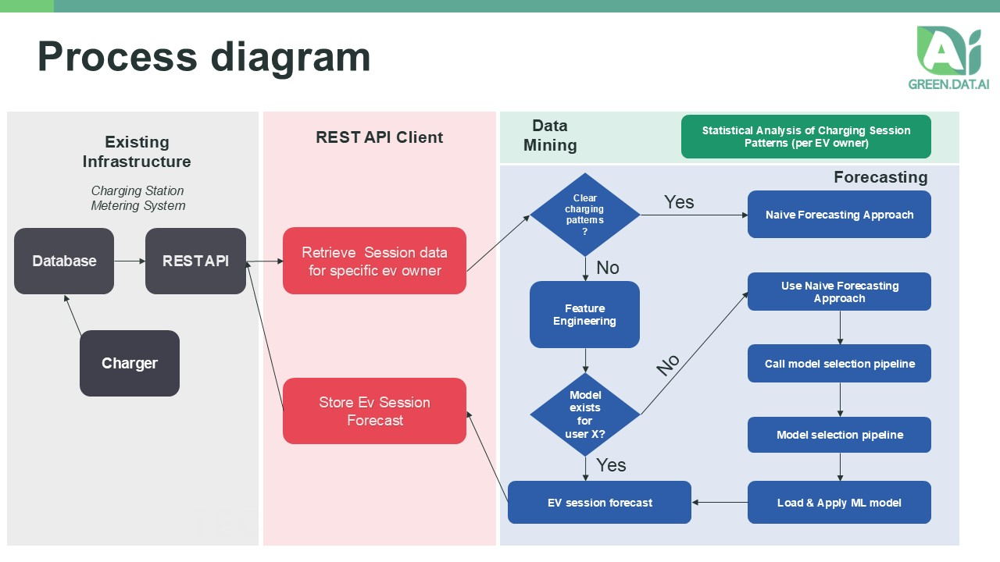

<p align="center">
  
</p>

# EV Session Forecaster

## Description:

The EV Session Forecaster Service forecasts Electric Vehicle (EV) session information, such as session duration, total energy transferred, and next session start time. This supports EV charging optimisation tools to maximise efficiency, minimise costs, and balance grid load. It uses historical EV charging session data per EV owner, sourced from a Charging Station Management System (CSMS) or an individual EV charger’s database.

The system is intended to be used alongside other systems designed within the scope of the Green.Dat.AI project.

**NOTE:** Useful Terminology is defined below.

- **EV Charging Session:** A charging session, from plug-in to unplugging.
- **EV Owner**: The user of the EV, responsible for charging at a station.
- **Charger**: The physical device that provides energy to recharge EVs.
- **CSMS (Charging Station Management System)**: Manages and monitors multiple EV chargers.
- **EVSE (Electric Vehicle Supply Equipment)**: The charging station hardware.
- **Session Duration**: Total time (in minutes) that an EV is connected during a session.
- **Total Energy Transferred**: Total energy (in kWh) delivered during a charging session.
- **Next Plug-in Time**: Estimated time until the EV owner returns for their next session
- **Naïve Forecasting Approach**: Uses simple historical rules (e.g., recent averages).
- **ML-Based Forecasting Approach**: Uses machine learning to learn patterns from data.

## Technology Stack

- Programming Language: Python
- Framework: FastAPI (served by Uvicorn)
- ML: XGBoost (for ML-based forecasts)
- Tools: Docker

### Project Status

Version: 0.0.1

This software has been evaluated in a real environment (INESC TEC premises) with real data from EV chargers. However, it is still in development and requires further testing and refinement before production deployment.

## Project Structure

```bash
ev-session-forecaster
├── app/
│   ├── conf/
│   │   ├── __init__.py
│   │   └── settings.py
│   ├── forecast/
│   │   ├── __init__.py
│   │   ├── core.py
│   │   ├── database.py
│   │   ├── pipeline.py
│   │   ├── processing.py
│   │   ├── validation.py
│   │   └── zipping_files.py
│   ├── routes/
│   │   ├── __init__.py
│   │   └── compute.py
│   ├── schemas/
│   │   ├── __init__.py
│   │   └── schemas.py
│   ├── sendEmail/
│   │   └── sendEmailClient/
│   │       ├── __init__.py
│   │       └── EmailClient.py
│   └── tests/
│       └── unit_tests/
│           ├── unit_test_check.py
│           ├── unit_test_extraction.py
│           ├── unit_test_features.py
│           ├── unit_test_parse.py
│           └── unit_test_post.py
├── docs/
│   ├── external/
│   │   └── swagger.yaml
│   ├── methodology/
│   │   ├── Methodology.png
│   │   └── process_flow.png
│   ├── uml/
│   │   ├── ev_session_forecast_prediction.svg
│   │   └── ev_session_forecast_training.svg
│   └── usage/
│       └── result_example.png
├── files/
│   ├── local/
│   │   └── data/
│   │       └── example_data.csv
│   └── logs/
├── Dockerfile
├── dotenv
├── local_execution.py
├── main.py
├── train.py
├── README.md
└── requirements.txt
```

## Methodology Overview

This system uses a hybrid forecasting approach, combining Naïve and ML-based methods. The choice of method depends on the amount of historical data available for each EV owner and/or its charging patterns.

Based on this information, forecasts are generated (per EV owner) for:

- EV Charging Session Duration (minutes)
- Total Energy Transferred during the charging session (kWh)
- Next Plug-in Time (datetime + per-day probabilities D0..D7+)

The following forecasting methods are implemented:

- **ML-Based Forecasting (XGBoost)**: Train and store a model per EV owner when enough data exists. Captures complex patterns for higher accuracy.

- **Naïve Approaches**: Rule-based forecasts that handle weekday/weekend differences. Falls back between weekend/weekday data when one is missing.

### Process Flow:

The image bellow illustrates the overall process flow:



- **Data Ingestion**: Charging session data is recorded in the external database.
- **Data Retrieval**: When a forecast is triggered, the backend retrieves historical session data for the EV owner.
- **Statistical Analysis**: If clear charging patterns exist, apply the Naïve approach; otherwise proceed to Feature Engineering for ML.
- **Forecast Method Selection**: If a pre-trained ML model exists for the EV owner, load and apply it; otherwise use the Naïve approach and trigger a pipeline to train and save an owner-specific XGBoost model.
- **EV Session Forecast**: Produce forecasts for: duration (minutes), total energy (kWh), and next plug-in (datetime + per-day probabilities D0..D7+).

### Results:

The results are provided in two modes:

- **API mode**: Forecasts are returned as JSON; optionally, the service can POST them to an external API when configured.

- **Local mode**: When running the local simulator, results are saved as CSV under `files/local/results/`.

## External components

To operationalize this project, you must configure two external components:

#### 1) EV Session Data Source (RESTful API)

Central database where EV charging session data (energy consumption and duration) is stored. This project assumes a centralized database (e.g., Charging Station Management System, or EVSE database) exists to aggregate metering and session data from EV charging stations, and that a RESTful API is available to access this data.

#### 2) Trigger for Forecast Computation:

The service can be triggered in two ways

- API Mode: A RESTful API endpoint is exposed to receive requests for forecasts. Each request must include the EVSE ID, user ID, and either a session ID or launch time. **Note that you will have to implement an external client to call this API when a forecast is needed. You can find an example for such client (using Python requests) in `examples/forecast_call.py`.**

#### Where will the forecasts be stored?

The forecasts computed by this service can be just returned (and stored) as JSON. However, if configured (see environment variable `PUBLISH_FORECASTS`), the service can also send the forecast results to an external RESTful API. The external API must should have an endpoint based on the schema defined in `docs/external/receiver_swagger.yaml`.

## Internal components:

This service is composed by several core components:

- **Data Retrieval:** Queries the external REST API to fetch historical charging session data for a specific EV owner.
- **Data Processing and Cleaning:** Prepare the raw data necessary for the forecasting process.
- **Feature Engineering:** Compute features from historical raw data.
- **Statistical Analysis:** Identify behavioural patterns and classify users. Depending on the category, choose Naïve or ML-based forecasts.
- **Forecasting:** Use Naïve rules and supervised models (XGBoost).
- **Email Notifications:** Send email alerts for errors and information.

## Installation

### Dependencies

Python dependencies are available in the `requirements.txt` file.

### Environment Variables

These variables must be configured for the service to operate. Please set them in a `.prod.env` file or as system environment variables. See the `dotenv` file for a template.

- API (GET)

  - API_KEY — API key for the external REST API to retrieve session data
  - API_URL — Base URL of the external REST API (used to retrieve metering/session data)
  - Note: Some templates may include API_URL_METERING or API_URL_FORECAST; the current code uses API_URL.

- API (POST, optional)

  - API_KEY_POST — API key to authenticate POSTing forecast results
  - API_URL_POST — Endpoint to receive forecasts created by this service

- Email
  - EMAIL_HOST — Email server hostname or IP
  - EMAIL_PORT — Email server port
  - EMAIL_PASSWORD — Email sender password
  - EMAIL_SENDER — Email sender address
  - EMAIL_RECIPIENTS — Email recipients for success/info emails
  - EMAIL_RECIPIENTS_DEBUG — Email recipients for debug/error emails

## Deployment

To update/deploy the service:

1. Build the Docker image

```shell
docker build -t ev-session-forecaster:latest .
```

2. Prepare the environment file `.prod.env` using `dotenv` as a template and set the required variables.

```shell
cp dotenv .prod.env
```

3. Train models (optional, recommended to update ML models per user). If you're using an environment file, ensure to include it with `--env-file .prod.env`.

```shell
docker run --rm --env-file .prod.env -v ev-session-forecaster-logs:/app/files ev-session-forecaster:latest python train.py
```

4. Run the service (stop/remove any existing container with the same name first). If you're using an environment file, ensure to include it with `--env-file .prod.env`.

```shell
docker run -p 8080:80 -d --restart unless-stopped --name ev-session-forecaster --env-file .prod.env -v ev-session-forecaster-logs:/app/files ev-session-forecaster:latest
```

## Usage

### Operational mode (API calls)

- Access the docs: http://localhost:8080/docs
- Endpoint: POST `/compute/forecast/session-data`
- Payload schema (send either session_id or launch_time, not both):

```json
{
  "evse_id": "EVSE123",
  "user_id": 17,
  "launch_time": "2025-01-07T09:00:00"
}
```

### Local simulation mode (loads local CSV with data and saves results to CSV)

1. Place input files in `files/local/data/` named like `<prefix>_data.csv` (an example is provided).
   - Expected CSV columns: session_id, evse_id, user_id, start_time, end_time, total_energy_transfered (Wh)
2. Install Python 3.12.3
3. Install dependencies from the project root:

```bash
pip install -r requirements.txt
```

4. Run the local simulator from the project root:

```bash
python local_execution.py
```

5. Optional: customise the date range in `local_execution.py` by editing:

- default_start_datetime / default_end_datetime
- custom_date_ranges

Outputs are saved under `files/local/results/`.

## UML Diagrams

You can find the UML diagrams illustrating both training and forecasting tasks with more detail in the `docs/uml/` folder.

## Extra topics:

### Main Challenges

This service still has some limitations that will be addressed in future work:

- Small dataset size. Note that the forecasting models are trained per EV owner which might limit the amount of data available for training (e.g., in our tests, the most active user has ~266 sessions over two years).
- Forecasting is done based solely on historical session data. We've tested using NWP as exogenous variables, but the results were inconclusive. Further investigation is needed.
- Data quality issues (missing values, outliers) required extensive cleaning and validation. Some issues encountered. These might occur also in future use cases, therefore the data validation module is crucial.
  - Missing values in key fields (e.g., start/end times, energy transferred)
  - Outliers in session duration and energy transferred
  - Inconsistent data formats (e.g., datetime strings)
  - Duplicate records
  - Timezone inconsistencies
  - Non-sequential session IDs
  - Sessions with zero or negative energy transferred
  - Sessions with end time before start time
  - Sessions with implausible durations (e.g., several days)
  - Sessions with implausible energy values (e.g., >100 kWh for a single session)

## Roadmap of future improvements

- Leverage SOTA datasets to augment training samples.
- Improve data cleaning and validation procedures.
- Improve feature engineering techniques and explore additional exogenous variables (e.g., )
- Include other time-series forecasting models
- Explore the potential of LLMs / Foundation Models for sequence / time-series EV session forecasting.
- Incorporate holidays and special dates into the feature set

## Connect with us

- José João Dias (jose.j.dias@inesctec.pt)
- Wellington Fonseca (wellington.w.fonseca@inesctec.pt)
- José Andrade (jose.r.andrade@inesctec.pt)
- Gil Sampaio (gil.s.sampaio@inesctec.pt)
